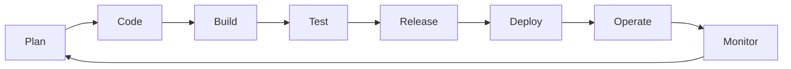

# DevOps: A Comprehensive Guide

## What is DevOps?

DevOps is a cultural and professional movement that stresses communication, collaboration, integration, and automation between software developers (Dev) and IT operations (Ops) professionals. The goal is to improve the speed and quality of software delivery by creating a culture and environment where building, testing, and releasing software can happen rapidly, frequently, and more reliably.

It is not just a set of tools but a **philosophy** and **practice** that breaks down the traditional silos between development and operations teams.

## The DevOps Lifecycle: A Continuous Loop

The DevOps process is often visualized as an infinite loop, representing the ongoing, iterative nature of modern software delivery. This loop consists of the following phases:

### 1. Plan
In this phase, teams ideate, define, and describe the features and capabilities of the applications they are building. Tools like **Jira**, **Trello**, or **GitHub Projects** are used to track progress and manage work.

### 2. Code
This phase involves writing the code for the application. Developers use **Version Control Systems (VCS)** like **Git** to collaborate, manage code versions, and conduct code reviews.

### 3. Build
After code is written, it is compiled and packaged into an executable artifact. This is where **Continuous Integration (CI)** practices come in. Tools like **Jenkins**, **GitLab CI**, and **GitHub Actions** automate the process of building and integrating code from multiple contributors.

### 4. Test
The built artifact is thoroughly tested to ensure quality and identify bugs. This includes automated unit tests, integration tests, and performance tests. Tools like **Selenium**, **JUnit**, and **TestNG** are common here.

### 5. Release
This is the phase where the application is deemed ready for deployment to production. **Continuous Delivery** automates the process of releasing validated code to a repository. Artifact repositories like **JFrog Artifactory** or **Nexus Repository** are often used to store release artifacts.

### 6. Deploy
The application is deployed to production environments. In a mature DevOps practice, this is automated as **Continuous Deployment**. Infrastructure-as-Code (IaC) tools like **Terraform** and **Ansible** help provision and configure infrastructure, while deployment tools like **ArgoCD** and **Spinnaker** manage the release process.

### 7. Operate
The application is now live and being used by customers. Operations teams ensure the infrastructure is stable and the application is available. Container orchestration platforms like **Kubernetes** are pivotal here.

### 8. Monitor
The application and infrastructure performance is continuously monitored. This phase provides crucial feedback on application behavior and user experience, which feeds back into the "Plan" phase. Tools like **Prometheus**, **Grafana**, **ELK Stack (Elasticsearch, Logstash, Kibana)**, and **Datadog** are industry standards.

## Why is DevOps Important? (Benefits)

*   **Faster Time to Market:** DevOps enables organizations to release new features and updates much more frequently and reliably.
*   **Improved Collaboration:** Breaks down organizational silos, creating more efficient teams that share responsibilities.
*   **Rapid Innovation:** Streamlined processes allow teams to experiment and innovate more quickly.
*   **Early Bug Detection:** Continuous testing and integration help find and resolve defects early in the development cycle.
*   **Improved Recovery Time:** Failures are detected and resolved faster, leading to higher mean time between failures (MTBF) and lower mean time to recovery (MTTR).
*   **Increased Efficiency & Automation:** Automates repetitive tasks, freeing up teams to focus on more valuable work.
*   **Greater Reliability:** Ensures the quality of application updates and infrastructure changes, leading to a more stable operating environment.
*   **Enhanced Security:** The adoption of **DevSecOps** integrates security practices automatically into the DevOps workflow.

## Key DevOps Practices

*   **Continuous Integration (CI):** The practice of frequently merging all developers' working copies to a shared mainline (e.g., several times a day). Each merge triggers an automated build and test process.
*   **Continuous Delivery (CD):** The practice of ensuring that code is always in a deployable state after passing through the CI pipeline. The actual deployment to production is a manual decision.
*   **Continuous Deployment (CD):** An extension of Continuous Delivery where every change that passes all stages of the production pipeline is automatically released to customers.
*   **Infrastructure as Code (IaC):** Managing and provisioning computing infrastructure through machine-readable definition files, rather than physical hardware configuration or interactive configuration tools.
*   **Monitoring and Logging:** Proactively monitoring application and infrastructure performance and aggregating logs to identify and understand issues.
*   **Communication and Collaboration:** Using agile methodologies and chat applications (like **Slack** or **Microsoft Teams**) to improve communication between teams.

## The DevOps Toolchain

DevOps leverages a wide array of tools to automate the various stages of the lifecycle.

| Phase | Popular Tools |
| :--- | :--- |
| **Plan** | Jira, Trello, Confluence, GitHub Projects |
| **Code** | Git, GitHub, GitLab, Bitbucket |
| **Build** | Jenkins, Maven, Gradle, GitHub Actions, GitLab CI |
| **Test** | Selenium, JUnit, TestNG, Cypress |
| **Release** | Jenkins, GitHub Actions, GitLab CI, JFrog Artifactory, Nexus |
| **Deploy** | **Kubernetes**, Docker, Terraform, Ansible, ArgoCD, Spinnaker |
| **Operate** | **Kubernetes**, Docker, OpenShift, AWS ECS |
| **Monitor** | **Prometheus**, Grafana, ELK Stack, Nagios, Datadog, New Relic |

## Getting Started with DevOps

1.  **Embrace the Culture:** Focus on collaboration, shared responsibility, and breaking down silos.
2.  **Start Small:** Begin by automating a single part of your workflow, like builds or tests.
3.  **Implement Version Control:** Use Git for all your code and configuration files.
4.  **Automate Your Builds:** Set up a CI tool (e.g., GitHub Actions) to build your code on every commit.
5.  **Measure Everything:** Implement basic monitoring and logging to get feedback from your systems.
6.  **Iterate and Improve:** Continuously refine your processes and tooling. DevOps is a journey, not a destination.

---
**References & Further Reading:**
*   [The Phoenix Project](https://itrevolution.com/the-phoenix-project/) by Gene Kim, Kevin Behr, and George Spafford
*   [AWS DevOps Documentation](https://aws.amazon.com/devops/what-is-devops/)
*   [Azure DevOps Documentation](https://azure.microsoft.com/en-us/overview/what-is-devops/)
*   [Google Cloud DevOps Resources](https://cloud.google.com/devops)
